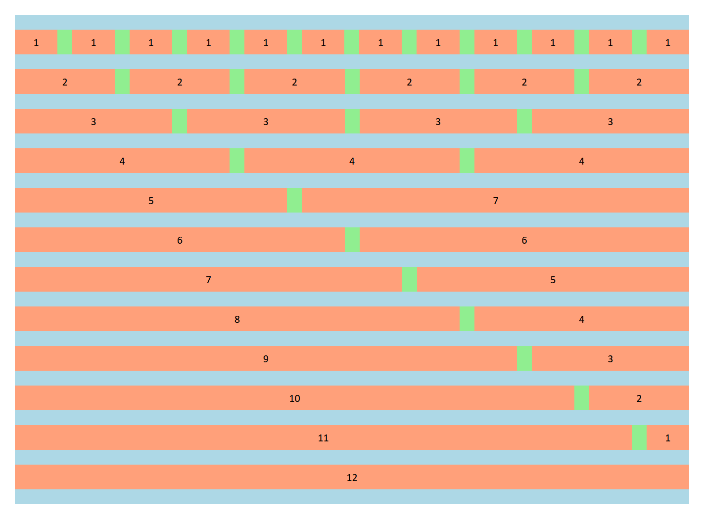

# 0.5.0 (2019-10-08)

### Features
- The flex-align mixin has been updated to include justification and alignment. It also ensures that the item it is applied to is automatically set to display: flex (which is requried for this to work)
  - Syntax: `u-<align-type[align|justify]>-<alignment-target[content|items]>-<alignment-position[start|center|end]>`
  - Example: `u-align-items-center` --or-- `u-justify-content-end`

# 0.4.0 (2019-09-03)

### Features
- Added new grid layout module has been added to allow for cleaner grid class names
- **The flex-grid module has been deprecated and will be removed on 2019-12-01**
- Added a deprecation notifier to alert when features have been deprecated and will be removed from the library

### Contributing
Husky has been added to lint styles prior to allowing commits. Stylelint is also run before build & release. If a stylelint is bypassed and a PR has linting errors it will be rejected and removed

# 0.3.2 (2019-07-01)
### Bug Fixes
- Re-ordered sizes in flex-grid map to ensure that they cascade properly

- Added breakpoints to flex-grid

# 0.3.1 (2019-06-26)
### Contributing
Stylelint has been added. Prior to contributing make sure you now run `npm run lint:fix`. This will automatically fix any linting errors. If there are still errors after this you will need to fix them on your own.

### Bug Fixes
- Fixing an issue with the flex grid hiding Material input labels when the input was focused (#22 closing #24)

- Fixed an issue where text was being overridden by the heading-size module. This module was removed as it is not within the scope of this library (#26 closing #25)

# 0.3.0 (2019-04-19)
### Features
- Added flex grid
  - Extremely useful for forms or layouts that require more rigidity while still being responsive.
  - **IMPORTANT NOTE:** Flex grid only has a specificity of 10, unlike the rest of Fulcrum which has a specificity of 20. This is by design as the flex-grid is meant to be a light layout utility, while still being able to take other Fulcrum classes for overrides. Flex column on the other hand has a specificity of 20.
  - Syntax:
    - `.u-flex-grid`: The wrapper for rows and elements
    - `.u-flex-row`: A row element. Wrapper for columns
    - `.u-flex-column`: A column element.
      - `.m--<size[small|medium|large]>-<width[1-12]>`: The amount of space the column will take up out of the 12 column grid
  - Example:
      ```html
      <div class="u-flex-grid">
        <div class="u-flex-row">
          <div class="u-flex-column m--small-1"></div>
        </div>
      </div>
      ```
  - Reference:
     

# 0.2.1 (2019-04-17)
### Bug Fixes
Fixed an issue where using `padding-[block|inline]` with keywords was using margin instead of padding (#6008e66 closing #13)

# 0.2.0 (2019-04-03)
### Features
- Margin and padding for elements has been updated:
  - Margins and paddings now have three different options so you do not have to add multiple classNames where you could use one
  - Syntax:
    - `.u-[margin|padding]-all-[number|keyword]`: Will add margin or padding at the block-start, block-end, inline-start, and inline-end
    - `.u-[margin|padding]-block-[number|keyword]`: Will add margin or padding at the block-start and block-end of the element
    - `.u-[margin|padding]-inline-[number|keyword]`: Will add margin or padding at the inline-start and inline-end of the element

### Bug Fixes
- Removed `includes` from modules and added to main stylesheet. This fixes an issue that was causing dupes if you wanted custom sizing (for things like spacers, margin, etc.) and included the file where needed.


# 0.1.0-rc4 (2019-02-15)
- Keyword spacers are here! 😄
  - Available sizes are:
    - `small`: 15px
    - `medium`: 30px
    - `large`: 45px
    - `x-large`: 60px
  - These can also be used for margin and padding
  - Syntax: `<div class="u-spacer-large"></div>`

# 0.1.0-rc3 (2019-01-22)
### Features
- Added `fontColor` and `textTransform` mixins (#5) (1450a7b) Closes #1 Closes #4 Closes #2
- `fontColor` usage:
  - **Syntax:** `u-font-color-<primary|accent|warn|normal>`
    ```html
    ...
    <p class="u-font-color-primary">Some text</p>
    ...
    ```
  - Can be customized by providing custom color values. The order is as follows
    - `@include fontColor($primary, $accent, $warn, $normal);`
- `textTransform` usage:
  - **Syntax:** `u-text-transform-<none|capitalize|uppercase|lowercase|full-width>`
    ```html
    ...
    <p class="u-text-transform-uppercase">Some text</p>
    ...
    ```
  - **Cannot** be customized by using `@include`

# 0.1.0-rc2 (2019-01-16)
### Features
- Increased specificity weight of all utility selectors to 20 to override predeclared rules without adding `!important` tags (#100644), closes #6
- Changed version number to represent release canidates


# Version 0.1.0-rc1
- IT'S A CSS LIBRARY! :)
- Initial library build, *DOES NOT HAVE AN ASSOCIATED RELEASE FILE*
